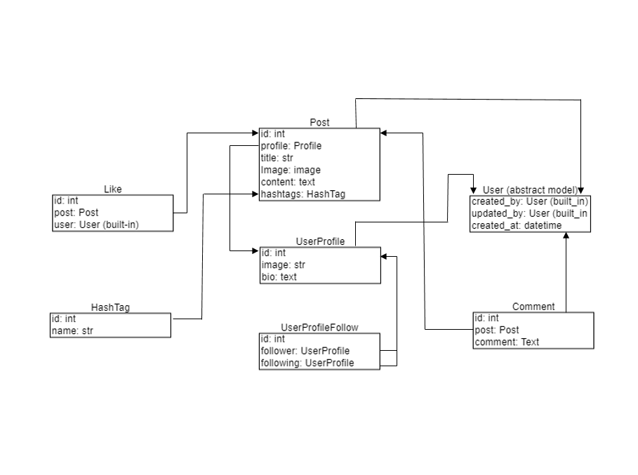

# Social Media API

###### The API allows users to create profiles, follow other users, create and view posts, manage likes and comments, and perform basic social media actions.

## Key Features

* **Authentication:** Users undergo secure registration and login processes, receiving JWTs for authenticated access.
* **User Profile Management:** Users can create and update their profiles, incorporating details such as profile pictures, bios, and other relevant information.
* **Follow/Unfollow System:** Establish connections by following and unfollowing other users. Track the list of followers and those being followed.
* **Post Creation and Retrieval:** Users can craft text-based posts and optionally attach images. Retrieve personal posts and those from followed users.
* **Likes and Comments:** Users have the option to like and unlike posts, view their liked posts, and engage with comments on posts.
* **API Permissions:** Strictly enforce permissions, ensuring that only authenticated users can create posts, like content, and follow/unfollow users. Users retain control over their own posts, comments, and profiles.
* **API Documentation:** Thorough documentation, available through the Swagger UI, provides clear instructions on each endpoint. Sample API requests and responses are included.
## DB structure 



## Installation
### Using GitHub

- Ensure you have `Python 3` installed.
- Clone repository to your local machine and change working directory:

```bash
git clone https://github.com/olmatiash/py-social-media-api/
```
- Create venv & Activate it:
`python3 -m venv venv`
`source venv/Scripts/activate`

- Install requirements:
`pip install -r requirements.txt`

- Create new User
- Set required data:
```
SECRET_KEY=<your secret key>
```
- Run migrations:`python manage.py migrate`
- Run app: `python manage.py runserver`

## Getting access
- create a user via **/api/user/register**
- get access token via **/api/user/token**